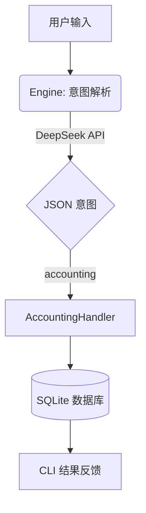

# 🚀 Any-Router: 极简个人意图路由与自动化 Agent


**Any-Router** 是一个极致轻量、超低成本的后台静默自动化 Agent。它专注于将用户的碎片化自然语言输入转化为结构化的 JSON 指令，并触发相应的自动化任务。

---

## ✨ 核心特性

- ⚡️ **超低成本**：采用无状态架构，单次请求消耗极低（约 200 Tokens），每月预算仅需数元即可支撑海量记账。
- 🧩 **结构化输出**：强制使用 `json_object` 模式，零幻觉，完美对接下游代码逻辑。
- 🔌 **高扩展性**：插件化 Handler 设计，可轻松扩展记账、日历、待办、智能家居等功能。
- 💻 **跨平台兼容**：针对 Windows 环境优化，完美解决控制台字符编码问题。

---

## 🛠 快速开始

### 1. 克隆项目
```bash
git clone https://github.com/kang915-deep/Any-Router.git
cd Any-Router
```

### 2. 配置环境变量
复制 `.env.example` 并填入你的 API Key：
```bash
cp .env.example .env
# 编辑 .env 文件，填入 DEEPSEEK_API_KEY=your_sk_key
```

### 3. 安装依赖
```bash
pip install -r pyproject.toml  # 或直接 pip install requests python-dotenv
```

### 4. 运行示例
```bash
python run.py "今天午饭花了38元"
# -> [SUCCESS] 已记录：支出 38.00 元 | 餐饮 | 午饭
```

---

## 📊 统计报表
```bash
python run.py --report today        # 查看今日财务摘要
python run.py --report this-month   # 查看本月财务摘要
```

---

## 🏗 项目架构



---

## 📜 许可证
本项目采用 [MIT License](LICENSE) 协议。
